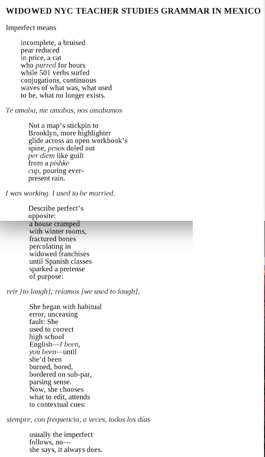

## Ancient Greek in action: the imperfect

As you've seen in this module, while the Greek imperfect and aorist tenses can both refer to events in the past, they express different ideas about how an event takes place in time. (This is sometimes called *grammatical aspect*).  

### A. Melisa Cahnmann-Taylor, "Widowed NYC Teacher Studies Spanish in Mexico"

Melisa Cahnmann-Taylor, poem from *Imperfect Tense*, "Widowed NYC Teacher Studies Spanish in Mexico"

### B. Jhumpa Lahiri, *In Other Words*

Jhumpa Lahiri, excerpt from *In Other Words*, "The Imperfect" (pp. 103-114)